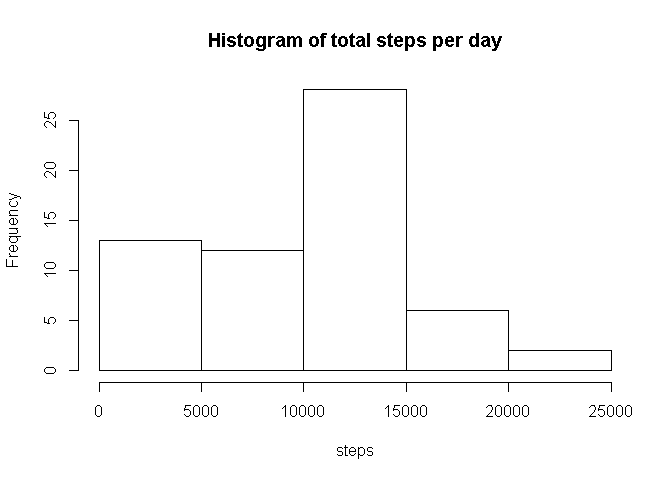
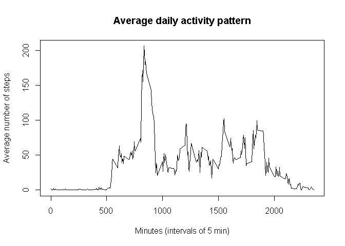
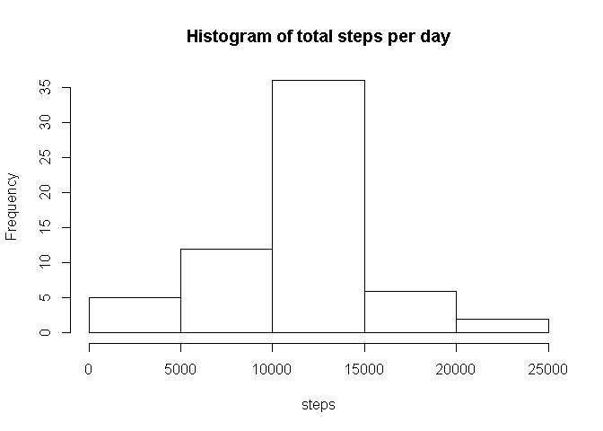
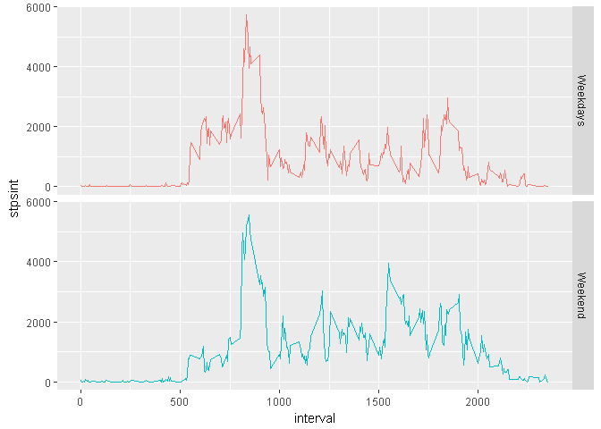

# Reproducible Research: Peer Assessment 1

First, set the working directory for the whole markdown

```r
knitr::opts_knit$set(root.dir = "C:\\Users\\Julio\\Documents\\data-science-jhuniversity\\5reproducliberesearch\\RepData_PeerAssessment1")
```

#Loading and preprocessing the data

###Load the data (i.e. read.csv())
The first thing we will do is to download the data directly from the web and we will decompress it, then I will load it.


```r
## set and identify source of data for the plot
sourceRecords <- "source.zip"
sourceUrl <- "https://d396qusza40orc.cloudfront.net/repdata%2Fdata%2Factivity.zip"
## check if file is already present
if (!file.exists(sourceRecords)) {
        download.file(sourceUrl,sourceRecords)
}
## check if file has been de-compressed or not
if (!file.exists("activity")){
        unzip(sourceRecords)
}
activity <- read.csv("activity.csv")
```

###Process/transform the data (if necessary) into a format suitable for your analysis


```r
require(lubridate)
```

```
## Loading required package: lubridate
```

```
## 
## Attaching package: 'lubridate'
```

```
## The following object is masked from 'package:base':
## 
##     date
```

```r
activity[,2] <- ymd(activity[,2]) #change to class date
```


#What is mean total number of steps taken per day?
(Note: for this part of the assignment, you can ignore the missing values in the dataset.)

###Calculate the total number of steps taken per day

```r
require(dplyr)
```

```
## Loading required package: dplyr
```

```
## 
## Attaching package: 'dplyr'
```

```
## The following objects are masked from 'package:lubridate':
## 
##     intersect, setdiff, union
```

```
## The following objects are masked from 'package:stats':
## 
##     filter, lag
```

```
## The following objects are masked from 'package:base':
## 
##     intersect, setdiff, setequal, union
```

```r
stepsperday <- activity %>% group_by(date) %>% summarize(stpsdy = sum(steps, na.rm=TRUE))
print(stepsperday)
```

```
## # A tibble: 61 x 2
##          date stpsdy
##        <date>  <int>
##  1 2012-10-01      0
##  2 2012-10-02    126
##  3 2012-10-03  11352
##  4 2012-10-04  12116
##  5 2012-10-05  13294
##  6 2012-10-06  15420
##  7 2012-10-07  11015
##  8 2012-10-08      0
##  9 2012-10-09  12811
## 10 2012-10-10   9900
## # ... with 51 more rows
```
        
###Make a histogram of the total number of steps taken each day

```r
hist(stepsperday$stpsdy, main= "Histogram of total steps per day", xlab="steps", breaks=5)
```

<!-- -->

###Calculate and report the mean and median of the total number of steps taken per day


```r
print(paste("The mean of steps per day is", floor(mean(stepsperday$stpsdy))))
```

```
## [1] "The mean of steps per day is 9354"
```

```r
print(paste("The median of steps per day is", median(stepsperday$stpsdy)))
```

```
## [1] "The median of steps per day is 10395"
```

# What is the average daily activity pattern?
### Make a time series plot (i.e. type = "l") of the 5-minute interval (x-axis) and the average number of steps taken, averaged across all days (y-axis)


```r
intervals <- activity %>% group_by(interval) %>% summarize(avgsteps = mean(steps, na.rm=TRUE))

with(intervals, plot(interval,avgsteps, type= "l", xlab="Minutes (intervals of 5 min)", ylab="Average number of steps", main = "Average daily activity pattern"))
```

<!-- -->

### Which 5-minute interval, on average across all the days in the dataset, contains the maximum number of steps?

```r
maxint <- intervals[which(intervals[,"avgsteps"] == max(intervals$avgsteps)), "interval"]

print(paste("The interval that contains the maximum number of steps on average is the interval", maxint$interval))
```

```
## [1] "The interval that contains the maximum number of steps on average is the interval 835"
```


# Imputing missing values
### Calculate and report the total number of missing values in the dataset (i.e. the total number of rows with NAs)

```r
print(paste("The total amount of rows with NAs is", sum(!complete.cases(activity)), " which correcpond to a ",
floor(mean(!complete.cases(activity))*100),"% of all rows."))
```

```
## [1] "The total amount of rows with NAs is 2304  which correcpond to a  13 % of all rows."
```

### Devise a strategy for filling in all of the missing values in the dataset. The strategy does not need to be sophisticated. For example, you could use the mean/median for that day, or the mean for that 5-minute interval, etc.

In this case, we will use the impute() function of the Hmisc package and impute using the mean of the whole column, just because it is easy to do.


```r
require(Hmisc)
```

```
## Loading required package: Hmisc
```

```
## Loading required package: lattice
```

```
## Loading required package: survival
```

```
## Loading required package: Formula
```

```
## Loading required package: ggplot2
```

```
## 
## Attaching package: 'Hmisc'
```

```
## The following objects are masked from 'package:dplyr':
## 
##     combine, src, summarize
```

```
## The following objects are masked from 'package:base':
## 
##     format.pval, round.POSIXt, trunc.POSIXt, units
```

```r
impstepsperday <- activity
impstepsperday[,1]<-impute(impstepsperday[,1], mean)
detach("package:Hmisc", unload=TRUE)
```
I dettached Hmisc since it messess up with dplyr...!


### Create a new dataset that is equal to the original dataset but with the missing data filled in.

```r
impstepsperday <- impstepsperday %>% group_by(date) %>% summarize(stpsdy = sum(steps, na.rm=TRUE))
```

### Make a histogram of the total number of steps taken each day and Calculate and report the mean and median total number of steps taken per day. 

```r
hist(impstepsperday$stpsdy, main= "Histogram of total steps per day", xlab="steps", breaks=5)
```

<!-- -->

```r
print(paste("The mean of steps per day is", floor(mean(impstepsperday$stpsdy))))
```

```
## [1] "The mean of steps per day is 10766"
```

```r
print(paste("The median of steps per day is", median(impstepsperday$stpsdy)))
```

```
## [1] "The median of steps per day is 10766.1886792453"
```

### Do these values differ from the estimates from the first part of the assignment? 
Yes they do!

### What is the impact of imputing missing data on the estimates of the total daily number of steps?


```r
print(paste("The total number of steps is increased by", sum(impstepsperday$stpsdy) - sum(stepsperday$stpsdy), "WOOOOOOOW (this is 2304 NA values times the mean (37.28)."))
```

```
## [1] "The total number of steps is increased by 86129.5094339623 WOOOOOOOW (this is 2304 NA values times the mean (37.28)."
```

#Are there differences in activity patterns between weekdays and weekends?

### Create a new factor variable in the dataset with two levels - "weekday" and "weekend" indicating whether a given date is a weekday or weekend day.


```r
steps <- activity
steps[,2] <- wday(steps[,2],label=TRUE)
wkdys <- c("Mon", "Tue", "Wed", "Thu", "Fri")
steps[,2] <- factor( steps[,2] %in% wkdys, levels = c(TRUE, FALSE), labels= c("Weekdays", "Weekend"))
```

###Make a panel plot containing a time series plot (i.e. type = "l") of the 5-minute interval (x-axis) and the average number of steps taken, averaged across all weekday days or weekend days (y-axis). 


```r
require(ggplot2)

steps <- steps %>% group_by(date, interval) %>% summarize(stpsint = sum(steps, na.rm=TRUE))
g <- ggplot(steps, aes(interval, stpsint, group = date, colour = date))
g + geom_line() + theme(legend.position = "none") + facet_grid(date ~ .)
```

<!-- -->


